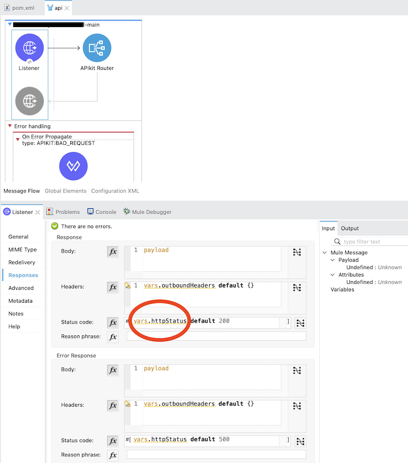
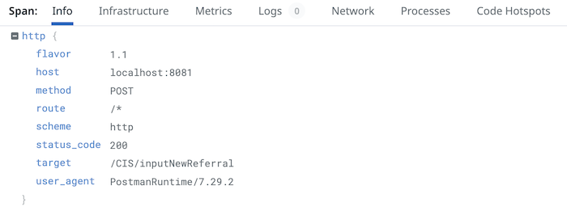

# Mulesoft OpenTelemetry Connector

Mulesoft connector that allows a service to participate or initiate a transaction with the standard library Open Telemetry

**Table of content**
1. [Introduction](#introduction)
2. [Architecture](#architecture)
3. [Configuration](#configuration)
    1. [Debugging applications in local](#debugging-applications-in-local)
       1. [Sending traces to a local Jaeger](#sending-traces-to-a-local-jaeger)
       2. [Sending traces to the log](#sending-traces-to-the-log)
    2. [Additional configuration](#additional-configuration)
4. [Using the connector](#using-the-connector)
    1. [Add custom tags](#add-custom-tags)
       1. [Environment tags](#environment-tags)
       2. [Runtime tags](#runtime-tags)
    2. [Retrieving the current span during a flow](#retrieving-the-current-span-during-a-flow)
    3. [Getting the status code for the service](#getting-the-status-code-for-the-service)
5. [Debugging the connector](#debugging-the-connector)
6. [Available tags in traces](#available-tags-in-traces)
   1. [Host](#host)
   2. [Process](#process)
   3. [OS](#os)
   4. [Telemetry](#telemetry)
   5. [Http](#http)
   6. [Mule](#mule)
7. [Compile](#compile)

# Introduction

OpenTelemetry is an open-source framework for collecting and processing telemetry data that is used by many companies and organizations to monitor and troubleshoot their applications in production. It provides a standard way to instrument applications, send telemetry data to a backend, and analyze it.

One of the key features of OpenTelemetry is its ability to trace the flow of a request through a distributed system. This is accomplished through the use of spans, which are units of work that are traced within a trace. Each span represents a single operation within the trace and can be used to represent a database query, a network request, or any other action that happens within the trace.

Spans are used to build a tree-like structure called a trace, which represents the flow of a request as it travels through a distributed system. Each span in the trace has a unique identifier and is associated with information about the operation it represents, such as the name of the operation, the start and end time, and any metadata or tags associated with the span.

In addition to tracing, OpenTelemetry also provides support for collecting metrics and logs. This allows you to get a comprehensive view of the performance and behavior of your application, which can be useful for identifying issues and optimizing performance.

One of the benefits of using OpenTelemetry is that it is vendor-neutral and easily integrates with a wide range of systems and tools. This means that you can use it with your choice's backend and analysis tools and switch between different ones without having to re-instrument your application.

Overall, OpenTelemetry is a valuable tool for anyone looking to monitor and troubleshoot their applications in production. It provides a standard way to collect and process telemetry data, and its support for tracing, metrics, and logs makes it a powerful tool for understanding the performance and behavior of your application.

# Architecture

This project uses the OpenTelemetry Java SDK https://github.com/open-telemetry/opentelemetry-java. The connector follows a minimalistic approach that helps to implement the following architecture.

*Architecture diagram*

The connector will send the telemetry data using the otlp protocol to an open telemetry collector that is responsible for collecting all inputs from the services, processing them, and exporting the data to an observability backend like Jaeger.
# Configuration

The connector embraces the configuration through the environment variables described in the OpenTelemetry SDK Auto-configure:
- https://github.com/open-telemetry/opentelemetry-java/blob/main/sdk-extensions/autoconfigure/
- https://opentelemetry.io/docs/reference/specification/sdk-environment-variables/
- https://github.com/open-telemetry/opentelemetry-specification/blob/main/specification/protocol/exporter.md

The basic parametrization can be done through the component configuration window:


*Configuration window*

| Parameter                                                                                                                                                                                                                                                                                  | Description                                                                                                                                                                                                                                                             |
|--------------------------------------------------------------------------------------------------------------------------------------------------------------------------------------------------------------------------------------------------------------------------------------------|-------------------------------------------------------------------------------------------------------------------------------------------------------------------------------------------------------------------------------------------------------------------------|
| Service name                                                                                                                                                                                                                                                                               | The name of the service that is used to name the main trace. Example: salesforce-customer-sapi. This value is connected with the environment variable: OTEL_SERVICE_NAME, described in the SDK documentation                                                            |
| Additional tags                                                                                                                                                                                                                                                                            | Specify resource attributes in the following format: key1=val1,key2=val2,key3=val3. Example: layer=sapi, environment:local. This value is connected with the environment variable: OTEL_RESOURCE_ATTRIBUTES                                                             |
| Collector endpoint | The OTLP traces endpoint to connect to. The default is http://localhost:4317 when the protocol is GRPC and http://localhost:4318/v1/traces when the protocol is HTTP/PROTOBUF. The value is connected with the environment variable: OTEL_EXPORTER_OTLP_TRACES_ENDPOINT |

Configuration example of the connector in the mule configuration file like global.xml:

```xml
<open-telemetry:config 
	name="Open_Telemetry_Connector_Config" 
	doc:name="Open Telemetry Connector Config" 
	doc:id="5c85f8ab-75c8-45b2-b93d-311337bc24bf" 
	serviceName="${deployment.name}" 
	additionalTags="environment=${env}, layer=papi" 
	collectorEndpoint="${otel.collectorendpoint}"
	doc:description="Using the standard configuration.&#10;&#10;Overriding the collector endpoint.">
</open-telemetry:config>
```

## Debugging applications in local

### Sending traces to a local Jaeger

By default, the connector will send the traces to localhost:4317. Jaeger server can be configured to collect traces using all-in-one mode. Documentation: https://www.jaegertracing.io/docs/1.38/getting-started/. Example:
Jaeger on local

```bash
./jaeger-all-in-one --collector.otlp.enabled=true
```

### Sending traces to the log

Using the default configuration values for the connector, start the mule engine with the next property
```bash
-M-Dotel.traces.exporter=logging
```

# Using the connector

By default, the connector will generate traces for every flow in your service and will pass automatically the span data to any service call that was imported from Anypoint Exchange. In the next example, Get Orders (number 2) and Get Customers (number 1) calls will propagate trace data to the child services.


Mule flow example

The complete trace data in the Observability Backend:


Traces example in Jaeger

## Add custom tags

### Environment tags

We can add tags to the traces related to environment variables, for example, environment name, name of the container, cloud region, instance number, etc. See in the configuration section of this document the parameter: Additional tags

### Runtime tags

In every flow, we can create custom tags for the trace, helping us to query traces using this data in the observability backend. In the next example, we added a custom tag at the beginning of the flow with the product number (poNumber)= 123604. The tag is sent with the telemetry data that later We use to query the traces. The process to add the tags to the flow is by setting the process variable `openTelemetryTags`

Example, business flow:


Example, setting business data on tags

Code for “Set Variable” operation. Setting variable:`openTelemetryTags`

```java
%dw 2.0
output application/java
---
{
  "poNumber": payload.orderData.poNumber default "",
  "firstName": payload.customer.firstName default ""
}
```

In the observability backend query by tag example:


Example, querying business data on tags

The search will give us all the traces with the tag query criteria. In the next image


Example, querying business data on tags results

## Retrieving the current span during a flow

The current span data can be retrieved by inspecting the value of the process variable `openTelemtryTrace`.  This data can be useful to send manually the current span to other services or connectors.

## Getting the status code for the service

By default, the connector uses the standard variable `httpStatus` to get the response from the service, for example:



Setting the httpStatus variable example

# Debugging the connector

To show the connector logs with debug level, add the next logger to log4j2.xml:

```xml

<AsyncLogger name="com.mulesoft.ot" level="DEBUG"/>
```

Available levels: INFO, DEBUG, TRACE

# Available tags in traces

Next is the list of the available tags that are included in the tracing.

## Host

A host is defined as a general computing instance.

| Attribute | Description |
| --- | --- |
| host.arch | The CPU architecture the host system is running on. |
| host.name | Name of the host. On Unix systems, it may contain what the hostname command returns, or the fully qualified hostname, or another name specified by the user. |

[*Open Telemetry Specification*](https://github.com/open-telemetry/opentelemetry-specification/blob/main/specification/resource/semantic_conventions/host.md)

## ****Process****

An operating system process

| Attribute | Description |
| --- | --- |
| process.command_line | The full command used to launch the process as a single string representing the full command. On Windows, can be set to the result of GetCommandLineW. Do not set this if you have to assemble it just for monitoring; use process.command_args instead. |
| process.executable.path | The full path to the process executable. On Linux based systems, can be set to the target of proc/[pid]/exe. On Windows, can be set to the result of GetProcessImageFileNameW. |
| process.pid | Process identifier (PID). |
| process.runtime.name | The name of the runtime of this process. For compiled native binaries, this SHOULD be the name of the compiler. |
| process.runtime.version | The version of the runtime of this process, as returned by the runtime without modification. |
| process.runtime.description | An additional description about the runtime of the process, for example a specific vendor customization of the runtime environment. |

[*Open Telemetry Specification*](https://github.com/open-telemetry/opentelemetry-specification/blob/main/specification/resource/semantic_conventions/process.md)

## OS

The operating system (OS) on which the process represented by this resource is running. In case of virtualized environments, this is the operating system as it is observed by the process, i.e., the virtualized guest rather than the underlying host.

| Attribute | Description |
| --- | --- |
| os.description | Human readable (not intended to be parsed) OS version information, like e.g. reported by ver or lsb_release -a commands. |
| os.type | The operating system type. |

*[Open Telemetry Specification](https://github.com/open-telemetry/opentelemetry-specification/blob/main/specification/resource/semantic_conventions/os.md)*

## TELEMETRY

The telemetry SDK used to capture data recorded by the instrumentation libraries.

| Attribute | Description |
| --- | --- |
| telemetry.sdk.name | The name of the telemetry SDK as defined above. |
| telemetry.sdk.language | The language of the telemetry SDK. |
| telemetry.sdk.version | The version string of the telemetry SDK. |

*[Open Telemetry Specification](https://opentelemetry.io/docs/reference/specification/resource/semantic_conventions/)*

## HTTP

The HTTP request, response, and headers tags

| Attribute | Description |
| --- | --- |
| http.flavor | Kind of HTTP protocol used |
| http.host | Logical local hostname or similar, see note below |
| http.method | HTTP request method |
| http.route | The matched route (path template in the format used by the respective server framework) |
| http.scheme | The URI scheme identifying the used protocol. |
| http.status_code | HTTP response status code |
| http.target | The full request target as passed in a HTTP request line or equivalent |
| http.user_agent | Value of the HTTP User-Agent header sent by the client. https://www.rfc-editor.org/rfc/rfc9110.html#field.user-agent |
| http.request_content_length | The size of the request payload body in bytes |
| http.content_type | Format type of the request payload |

Java Semantic Definition: [https://github.com/open-telemetry/opentelemetry-java/blob/main/semconv/src/main/java/io/opentelemetry/semconv/trace/attributes/SemanticAttributes.java](https://github.com/open-telemetry/opentelemetry-java/blob/main/semconv/src/main/java/io/opentelemetry/semconv/trace/attributes/SemanticAttributes.java)

Example:



Http tags example

## MULE

MULE service metadata

| Attribute | Description | Runtime value |
| --- | --- | --- |
| mule.serverId | Server Id | EnrichedServerNotification.getServerId() |
| mule.service.flow.name | The resourceIdentifier is used when firing inbound server notifications such as Admin notifications or other action notifications triggered by an external source Used to associate the event with a particular resource. | EnrichedServerNotification.getResourceIdentifier() |

**SOURCE**. Metadata about the source component which originates the flow. The runtime value is taken from:

```
ComponentIdentifier sourceIdentifier = enrichedServerNotification
																				.getEvent()
																				.getContext()
																				.getOriginatingLocation()
																				.getComponentIdentifier()
																				.getIdentifier();
```

Attributes

| Attribute | Description | Example |
| --- | --- | --- |
| mule.service.flow.source.configRef | Configuration reference | HTTP_Listener_configuration |
| mule.service.flow.source.name | Name of the component | listener |
| mule.service.flow.source.namespace | Namespace | http |

In the next image the listener component is the source:


**PROCESSOR**. Metadata about the component that creates a new span. The runtime value is taken from:

```
org.mule.runtime.api.component.ComponentIdentifier =
			enrichedServerNotification.getComponent().getIdentifier().getName()
```

Attributes

| Attribute | Description | Runtime value |
| --- | --- | --- |
| mule.service.processor.name | Connector name | request |
| mule.service.processor.namespace | Namespace | http |
| mule.service.processor.docname | XML attribute value for doc:name | errorWriter request |
|  mule.service.processor.configRef | Configuration reference | HTTP_Request_configuration |

# Compile

To compile and deploy the connector to your Anypoint Exchange run in your terminal:

```bash
mvn deploy
```

The project includes a code format plugin: `spotless-maven-plugin` This plugin follows the eclipse format rules and the documentation can be found [here](https://github.com/diffplug/spotless/tree/main/plugin-maven). When the code has format errors, those can be fixed by running:

```xml
mvn spotless:apply
```

Increase the version number in pom.xml

```xml
<version>1.0.41</version>
```

Update the version in constant LIBRARY_VERSION in java class: `Constants.java`. This value

```java
public static final String LIBRARY_VERSION = "1.0.41";
```